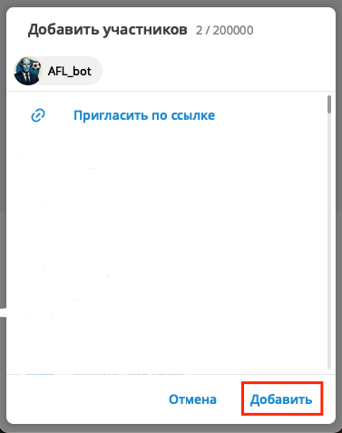
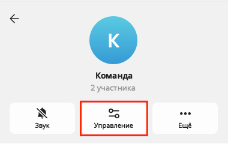
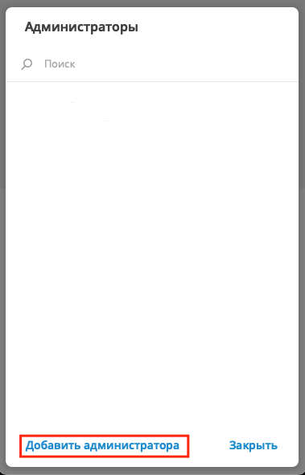
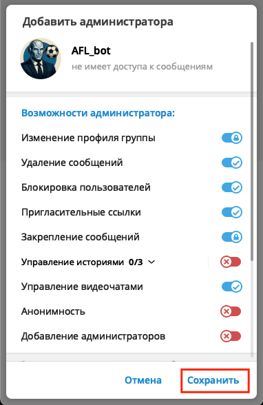

# Начало работы

## Добавление бота в чат
Добавьте бота в чат команды:

Зайдите в меню управления чатом

Выберите пункт "Ещё"

Затем "Добавить участников"

Найдите бота в списке

Нажмите "Добавить"

Затем ещё раз "Добавить"

## Выдача прав
Выдайте боту права администратора

Зайдите в меню управления чатом

Выберите пункт "Управление"

Выберите пункт "Администраторы"

Нажмите "Добавить администратора"

Затем выберите бота

Выставьте переключатели в таком же порядке, как на скриншоте и нажмите "Сохранить"

## Получения ID чата
Запустите команду `/chat@ReddysAdmin_bot`

Бот даст понять реакцией, что команда сработала успешно

Напишите администрации, что все шаги сделаны