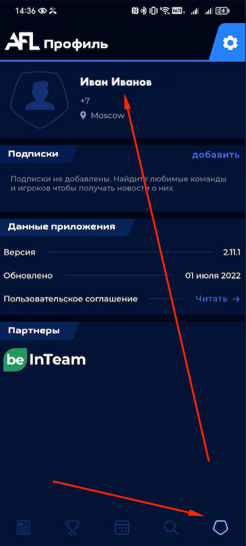
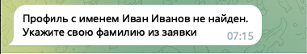

# 👤 Профиль

Так будет выглядеть ваш профиль изначально.

## ✏️ Изменить имя

Во вкладке "✏️ Изменить имя" вы можете указать имя, которое будет отображаться
в общем рейтинге пользователей.

Если вы не привязали свой профиль к AFL, то
рекомендуется указать Ваши ФИО так же, как в заявке AFL.

Чтобы изменить имя, нажмите кнопку "✏️ Изменить имя" и 
следуйте инструкциям от бота.

## ⚙️ Связать профиль с AFL

Для связи профиля в боте, и профиля в AFL у Вас должно совпадать имя в боте и
в профиле AFL. Если требуется - укажите правильное имя в боте.

Чтобы связать профиль, нажмите кнопку "⚙️ Связать профиль с AFL".

Если бот не сможет найти Ваш профиль, укажите имя правильно или 
обратитесь к администрации

Если бот найдет Ваш профиль в AFL он спросит подтверждения для связи профилей.
Проверьте что это ваш профиль и подтвердите действие.

Если бот нашел профиль, но вы видите что он не Ваш - попробуйте указать имя
правильно или обратитесь к администрации