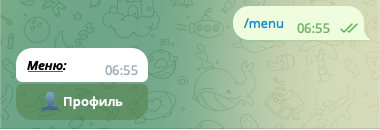

# Главное меню

## Вызов меню

Вызывать главное меню можно с помощью команды `/menu` прописав её вручную, или нажав на кнопку в чате с ботом:\

Бот ответит вам сообщением с кнопками:

## Работа с меню

### 👤 Профиль

Во вкладке "👤 Профиль" каждый пользователь может:

1. Изменить свои ФИО
2. Связать свой профиль с профилем лиги AFL

